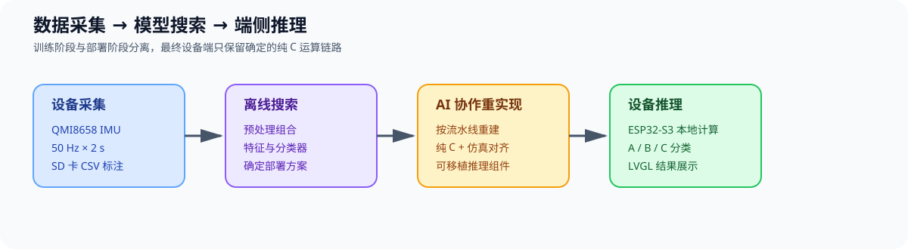

# ESP32-S3 端侧 AI 手势识别：从数据采集到纯 C 部署

**职责**：方案设计 / 数据采集 / 算法迁移 / AI 协作 / MCU 部署

## 背景

基于嘉立创实战派 ESP32-S3 与 QMI8658 六轴 IMU，完成端到端手势识别 Demo：设备以 50 Hz 采集 2 秒加速度，支持 A/B/C 标注写入 SD 卡并通过 Web 文件管理器导出；PC 离线训练后，将纯 C 推理部署回设备，在 ESP32-S3 本地分类。

我此前负责 AI 道钉低功耗设备：电池供电，目标寿命至少 3 年；加速度计事件唤醒 MCU，连续采集后端侧判断威胁，择机 4G 上报。真实项目涉密，故用此 Demo 展示同类端侧 AI 能力。

## 职责

- 定义 50 Hz / 2 秒采集窗口与 A/B/C 分类目标，自行采集 152 条数据：A 50、B 50、C 52。
- 使用 AutoML 搜索算法路径；导出的 `.a` 黑盒依赖特定芯片，无法直接用于 ESP32-S3。
- 用 AI 工具重写预处理、特征工程和推理，仿真对齐 AutoML 输出后完成纯 C 移植、设备验证与验收。

## 设备效果

| 数据采集 | 实时推理 |
|---|---|
|  |  |

| A 类手势 | B 类手势 | C 类手势 |
|---|---|---|
|  |  |  |

## 技术路线

`QMI8658 → 50 Hz/2 s → 标注/SD 卡/Web 导出 → AutoML → 纯 C → ESP32-S3`

`去均值 → STFT/FFT → 192 维特征 → 线性 SVM → Softmax + Argmax`

## 交付内容

- **端侧运行**：ESP32-S3 本地完成 A/B/C 实时分类，纯 C 实现，无动态内存分配。
- **算法对齐**：300 个输入值转换为 192 维特征；重实现结果与 AutoML 对齐后移植。
- **资源与验证**：模型常量约 3.1 KB，峰值栈约 4–5 KB，毫秒级推理；训练集 152/152，交叉验证 KPI 约 0.97。

## 项目边界

这是一个简化的能力 Demo，不代表真实生产产品。当前只验证了 A/B/C 三类简单手势的采集、训练和端侧推理；真实任务还要根据输入序列、噪声、触发条件和目标区分度重新选型。

真实应用需要专门考虑抗干扰：静止、随机晃动、碰撞噪声等干扰不能被强行归入 A/B/C。应按干扰来源采集数据，为不同类型干扰设计对应分类或拒识出口，让干扰有明确去处，避免误判为目标手势。

[GitHub 仓库](https://github.com/createskyblue/esp32s3-imu-gesture-recognition) · [演示视频](https://www.bilibili.com/video/BV1oSbX6DEbN)

